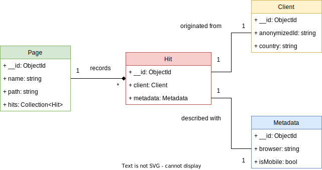

# mongo

Data model schemas for MongoDB

---

The following diagram describes `nolytics` data model, oriented for document based in `MongoDB`. In the [`schemas`](src/schemas/) folder you can find each document schema represented in JSON, ready to be loaded in MongoDB.

